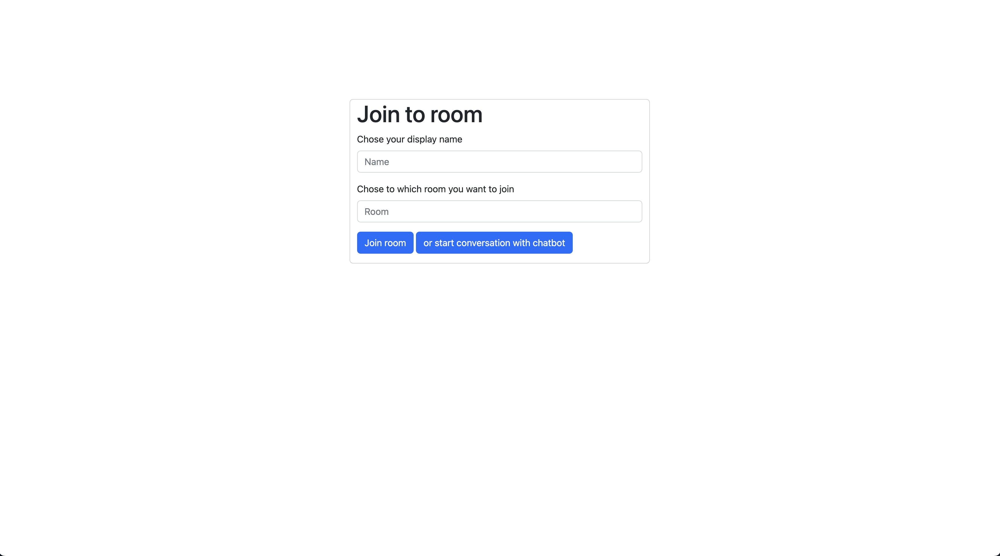
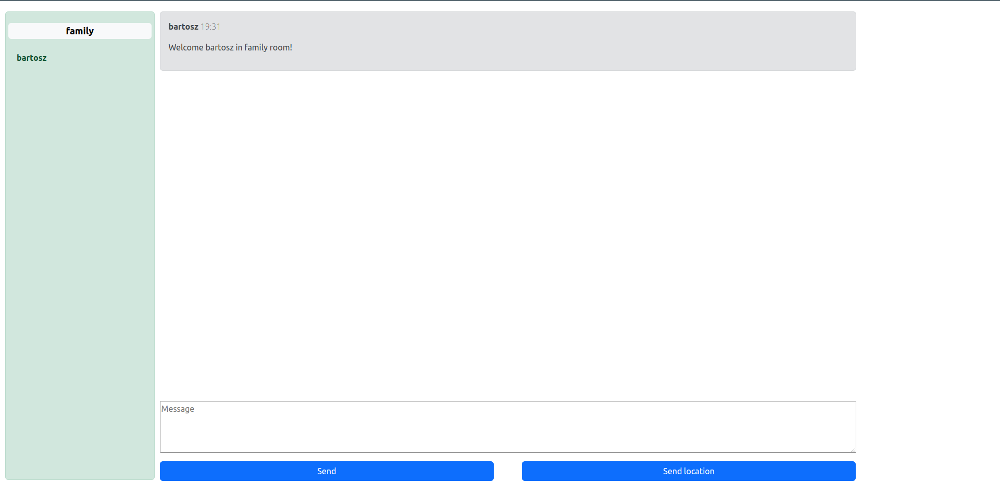

# Chat room

## Description
Application allows to have a chat in rooms. It is written in NodeJS and use WebSocket and Bootstrap libraries.

## Technologies
- NodeJS
- Mustache
- Bootstrap

## Installation

### Requirements 
 - NodeJS 12 or later
 - git (not required)

### Installation steps
1. Clone application by git or download it as ZIP and unpack it
```
git clone https://github.com/Bartosz95/chat-room.git
cd chat-room && npm install --production
```
2. Set a enviroment. You can use what port you want. By default it run on port 80.
```
export PORT=80
```
## Launch
Run the application.
```
npm start
```
## Examples

Open webbrowser on "http://localhost/" . You should see welcome page like below.



Now you have to fill fields. You should chose your name and room name. You cannot get access to room if your name is already in use in particular room. 

After press Join button you will redirect to room chat. Page will be looks like below.

If another user join to room you will get message about it and you will see his username on sidebar on left side.

You can send messages to others in the room. New messages will appear on the bottom of the messages view unless you scroll the window.

You can also send your localisation. After user click in the link, new tab will open and he see you localisation.

### Summary
Application allowed to get familiar with WebSocket in Node JS.

#### Addition info:
*Application was based on tutorial The Complete Node.js Developer Course (3rd Edition) which was created by Andrew Mead, Rob Percival and published by Packt Publishing*